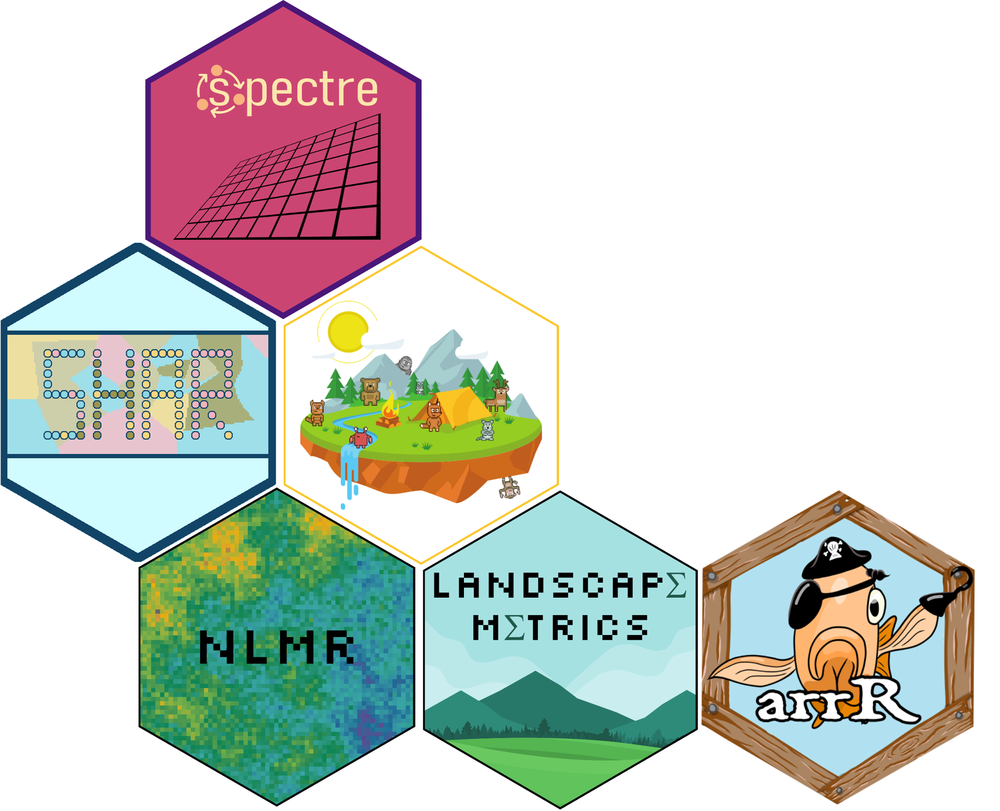
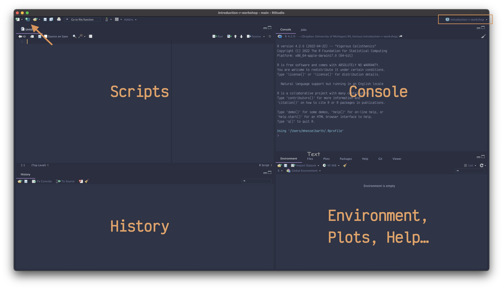
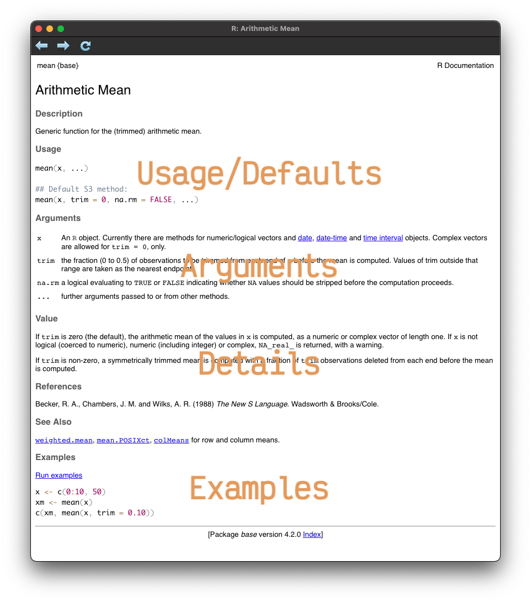

```{r setup, include=FALSE}
library(ggplot2)
library(kableExtra)
library(knitr)
library(magrittr)
library(palmerpenguins)
library(readxl)
library(xaringan)
library(xaringanthemer)

knitr::opts_chunk$set(echo = TRUE, collapse = TRUE)
```

```{r xaringan-themer, include=FALSE, warning=FALSE}
library(xaringanthemer)

xaringanthemer::style_duo(
  header_font_google = google_font("Abril Fatface"), # Abril Fatface
  text_font_google   = google_font("Ubuntu"), # Ubuntu # Coming soon
  
  background_color = "#93b593", # mint
  primary_color = "#1e475c", # blue
  secondary_color = "#b75044", # red
  text_color = "#000000", # black
  link_color = "#eec673", # yellow
  colors = c(darkred = "#6b2b1b", rose = "#e07c64", orange = "#e1904e", grey = "#263238")
)

# darkred : #6b2b1b
# red     : #b75044, secondary
# rose    : #e07c64
# orange  : #e1904e
# yellow  : #eec673, link
# mint    : #93b593, background
# blue    : #1e475c, primary

extra_css <- list(
  ".ref" = list("font-size" = "75%", "font-style" = "italic", "color" = "#263238"),
  ".small" = list("font-size" = "75%"), 
  ".tiny" = list("font-size" = "65%"), 
  ".nonum .remark-slide-number" = list("display" = "none"), 
  ".remark-code" = list("font-size" = "15px")
)

style_extra_css(css = extra_css)
```

class: inverse, center, middle, nonum

.pull-left[
# Introduction to _R_

### Maximilian H.K. Hesselbarth

#### University of Michigan (EEB)

2022-06-30 / 2022-07-01 
]

.pull-right[
```{r first_then, echo=FALSE, fig.align='center', out.width='85%'}
knitr::include_graphics("img/first-then.png")
```

.ref[Artwork by @allison_horst]
]

`r icons::fontawesome("envelope")` [mhessel@umich.edu](mailto:mhessel@umich.edu) `r icons::fontawesome("globe")` [www.maxhesselbarth.com](https://www.maxhesselbarth.com) `r icons::fontawesome("twitter")` [@MHKHesselbarth](https://twitter.com/MHKHesselbarth)

---

class: center, middle, nonum

All slides available at: [https://mhesselbarth.github.io/introduction-r-workshop/](https://mhesselbarth.github.io/introduction-r-workshop/)

---

# About myself

.pull-left[
```{r hex, echo = FALSE, out.width = "100%", fig.align = "center"}

```
]

.pull-right[
- Member of the [Coastal Ecology and Conservation Lab](https://www.jacoballgeier.com) .small[("Allgeier Lab")]

- Working on **individual-based simulation modelling**, **landscape ecology**, **point pattern analysis** and spatial data in general

- Author/Contributor of several _R_ packages: _landscapemetrics_ .ref[(Hesselbarth et al. 2019)], _shar_ .ref[(Hesselbarth 2021)], _arrR_ .ref[(Esquivel et al. 2022)] and others
]

---

class: inverse, left, bottom, clear, nonum

## Section 1: Basic introduction

---

background-image: url("img/r-logo.png")
background-position: 95% 5%
background-size: 10%

# _R_ programming language

--

- Widely used programming language for **statistical analysis**, **data science** and much more

--

- [_R_](https://www.r-project.org) is **free**, **open-source**, and **multi-platform** (_Windows_, _macOS_, _Linux_)

--

- Allows open, reproducible, and transparent research 

--

- Very active and generally **friendly community** .small[(`r icons::fontawesome("twitter")` [#rstats](https://twitter.com/hashtag/RStats), [#rspatial](https://twitter.com/hashtag/RSpatial))]

--

- Very popular in ecology .ref[(Atkins et al. 2022, Hesselbarth et al. 2021, Joo et al. 2020, Lai et al. 2019)]

--

- Integration of other programming languages (e.g., `Python`, `C`, `C++`)

---

background-image: url("img/rstudio-logo.png")
background-position: 95% 5%
background-size: 15%

# _RStudio_

--

- [_RStudio_](https://www.rstudio.com) as **integrated development environment** (IDE)

--

- **Write**, save and **run** _R_ code scripts

--

- Includes syntax-highlighting, auto-completion, figure and help panels, ...

```{r rstudio, echo=FALSE, fig.align='center', out.width='60%'}

```


---

background-image: url("img/r-logo.png")
background-position: 95% 5%
background-size: 10%

# _R_ as a calculator

--

.pull-left[
`+` Addition

`-` Subtraction

`*` Multiplication

`/` Division

`^` Exponentiation
]

--

.pull-right[
```{r calc}
# add two numbers
14 + 5

# combination of different operators
(23 - 5) / (4 * 5) ^ 2
```

`#` for comments in code
]

--

<br>

`==`, `!=`, `>=`, `<=` Logical operators

`&` "and" statement

`|` "or" statement

---

background-image: url("img/r-logo.png")
background-position: 95% 5%
background-size: 10%

# _R_ Objects

--

.pull-left[
- **Store** information into objects (also called variables sometimes)

- Once objects are assigned using the `<-` operator, they can be **reused**

- Use `snake_case` or `camelCase` naming 
]

--

.pull-right[
```{r objects}
# that's my age
my_age <- 31

# that's the global life expectancy
global_expectancy <- 90

# ...well...
(progress <- (my_age / global_expectancy) * 100) #<<

# check if I'm still below 1/2
progress <= 50
```
]

---

background-image: url("img/r-logo.png")
background-position: 95% 5%
background-size: 10%

--

.pull-left[
## Data types
- numeric : `5.34`

- integer : `5L`

- character : `"fish"`

- logical : `TRUE`/`FALSE`

- .grey[(complex : `1+4i`)]
]

--

.pull-right[
## Data structures

- `vector c()`
Collection of elements/values of same type

- `matrix()`
Multi-dimensional _vector_ (rows, columns)

- `data.frame()`
Tabular data that allows different types in columns, but same number of rows

- `list()`
List of different types and/or structures (allows all of above)
]

---

background-image: url("img/r-logo.png")
background-position: 95% 5%
background-size: 10%

# Vectorization

--

- Vectorization one major **strength** of _R_

--

- Operations are applied to **all** elements of vector (or combinations)

--

```{r vectorization}
# create named vector with extinction numbers
extinct <- c("amphibians" = 35, "birds" = 159, "fish" = 80, "mammals"  = 85)

# log of all values
log(extinct)

# calc relative number in relation to maximum
(max_number <- max(extinct))
extinct / max_number * 100 #<<

# multiply all values with log values
extinct * log(extinct) #<<
```

.ref[Source: https://ourworldindata.org/extinctions]

---

class: inverse, center, middle

# Palmer penguins dataset

```{r penguins, echo = FALSE, fig.align= "center", out.width = "65%"}
knitr::include_graphics("img/penguins.png")
```

.ref[Horst et al. 2020]

---

background-image: url("img/r-logo.png")
background-position: 95% 5%
background-size: 10%

# Indexing .tiny[(1/3)]

.pull-left[
```{r index_vector}
# create species vector (characters)
species <- c("Adelie", "Chinstrap", "Gentoo")

class(species)

# subset second object
species[2] #<<

# subset first and third object
species[c(1, 3)] #<<

# subset everything BUT second object
species[-2] #<<

(species[1:3] <- c("spec_1", "spec_2", "spec_3"))

c(species, "unknown")
```
]

.pull-right[
- Generally, indexing uses square brackets `object[element]`

- **Positive** or **negative** indexing possible
]

---

background-image: url("img/r-logo.png")
background-position: 95% 5%
background-size: 10%

# Indexing .tiny[(2/3)]

.pull-left[
- For _matrices_ and _data.frames_, **two** indices are required `object[rows, cols]`

- _data.frame_ columns and **named elements** can be accessed using `object$name`
]

.pull-right[
```{r index_matrix}
class(penguins)

# subset rows 1-5 and columns 1, 3, 8
penguins[1:5, c(1, 3, 8)] #<<

# subset body mass column as vector
body_mass <- penguins$body_mass_g
```
]

---

background-image: url("img/r-logo.png")
background-position: 95% 5%
background-size: 10%

# Indexing .tiny[(3/3)]

- Logical **tests** can be used to subset using `object[TRUE/FALSE-vector]`

- If either row or column index is empty, **all** are returned

```{r index_logical}
# subset all individuals with body mass larger than 4000
penguins[penguins$body_mass_g > 4000, ] #<<
```

---

background-image: url("img/r-logo.png")
background-position: 95% 5%
background-size: 10%

# Functions .tiny[(1/3)]

--

.pull-left[
- Block of code that takes **input** and creates **output**

- **Packages** are **collections** of functions provided by the community

```{r libs}
library(palmerpenguins)
library(scales)
```
]

--

.pull-right[
- Most functions take input value and often additional **arguments**

- Functions are evaluated from **inside** to **outside**

- Pass values by name or argument

```{r functions}
# standardize body mass to 0-1 scale, 
# calculate mean, and calculate log
log(mean(rescale(body_mass, to = c(0, 1)), na.rm = TRUE))

head(rescale(body_mass, to = c(1, 2)))
head(rescale(body_mass, c(1, 2)))
```
]

---

background-image: url("img/r-logo.png")
background-position: 95% 5%
background-size: 10%

# Functions .tiny[(2/3)]

.pull-left[
- Use e.g., `?mean` to open **documentation** for help

- Very **powerful resource** to understand and apply functions
]

.pull-right[
```{r help_mean, echo = FALSE, fig.align = "center", out.width = "100%"}

```
]

---

background-image: url("img/r-logo.png")
background-position: 95% 5%
background-size: 10%

# Functions .tiny[(3/3)]

--

- Very easy to create **own** functions using `fun_name <- function(arg1, arg2,...){body}`

--

- _R_ always returns the **last line** or explicit `return()` statement.

--

```{r own_function}
calc_area <- function(x, y, total = FALSE, na.rm = TRUE){ #<<
  
  # multiply length * width
  area <- x * y
  
  # calculate sum of all values
  if (total) {
    area <- sum(area, na.rm = na.rm) #<<
  }
  
  return(area) #<<
}

head(calc_area(penguins$bill_length_mm, penguins$bill_depth_mm))

calc_area(penguins$bill_length_mm, penguins$bill_depth_mm, total = TRUE)
```

---

class: inverse, left, bottom, clear, nonum

background-image: url("img/meme-google.png")
background-position: 50% 25%
background-size: 35%

## Exercise 1: Basic introduction

... work on [_exercise-section-1.Rmd_](https://github.com/mhesselbarth/introduction-r-workshop/blob/main/exercises/exercise-section-1.Rmd) ... 

---

class: inverse, left, bottom, clear, nonum

## Section 2: Data wrangling and some stats

---

background-image: url("img/r-logo.png")
background-position: 95% 5%
background-size: 10%

# Importing data

--

- `read.table()` to import tabular **text files** (e.g., _file.csv_)

--

- _readxl_ packages to import **Excel** files

--

```{r read_data, warning = FALSE, message = FALSE}
# import tabular text data file (most robust)
penguins_csv <- read.table(file = "data/penguins.csv", 
                           header = TRUE, sep = ",") #<<

# read MS Excel file
penguins_excel <- readxl::read_xlsx(path = "data/penguins.xlsx", sheet = "clean", 
                                    col_types = c("text", "text", "numeric", "numeric",
                                                  "numeric", "numeric", "guess", "guess"))

head(penguins_excel, n = 3)
```

---

background-image: url("img/r-logo.png")
background-position: 95% 5%
background-size: 10%

# Modify _data.frames_

.pull-left[
- **Modify** or **add** _data.frame_ columns by assigning values
]

.pull-right[
```{r data.frame}
# remove all rows that have NA value
head(complete.cases(penguins))
penguins <- penguins[complete.cases(penguins), ]

# modify existing columns
penguins$year <- factor(penguins$year) #<<

# create new columns based on existing ones
penguins$body_mass_kg <- penguins$body_mass_g / 
  10000

penguins$bill_area <- penguins$bill_length_mm * 
  penguins$bill_depth_mm

# completely new
penguins$rand <- runif(n = nrow(penguins))
```
]

---

background-image: url("img/dplyr.png")
background-position: 95% 5%
background-size: 10%

# _dplyr_ package .tiny[(1/3)]

--

.pull-left[
- Part of the larger [_tidyverse_](https://www.tidyverse.org) _R_ package collection

- Many useful functions (mostly) to deal with _data.frames_

- Also provides **pipe** operator, which allows to write `x %>% f() %>% g()` instead of `g(f(x))`
]

--

.pull-right[
```{r dplyr_filter}
# filter by sex and body mass
dplyr::filter(penguins, sex == "female", #<<
              body_mass_kg > 0.5) %>% #<<
  # return only selected columns
  dplyr::select(species, sex, body_mass_kg) %>% 
  # show last 5 rows
  tail(n = 5)
```
]

---

background-image: url("img/dplyr.png")
background-position: 95% 5%
background-size: 10%

# _dplyr_ package .tiny[(2/3)]

--

- `mutate()` to modify or add _data.frame_ columns

--

- Can be combined with `case_when()` for if-else statements

--

```{r dplyr_mutate}
dplyr::filter(penguins, sex == "female", body_mass_kg > 0.5) %>% 
  dplyr::select(species, sex, body_mass_kg) %>% 
  dplyr::mutate(body_mass_pounds = body_mass_kg * 2.20462, #<<
                body_class = dplyr::case_when(body_mass_pounds < 1.125 ~ "light", #<<
                                              body_mass_pounds > 1.125 ~ "heavy")) #<<
```

---

background-image: url("img/dplyr.png")
background-position: 95% 5%
background-size: 10%

# _dplyr_ package .tiny[(3/3)]

.pull-left[
- `group_by()` and `summarize()` to calculated **group values**
]

.pull-right[
```{r dplyr_group}
dplyr::group_by(penguins, species) %>%
  dplyr::summarise(n = dplyr::n(), 
                   max_g = max(body_mass_g))
```
]

---

background-image: url("img/r-logo.png")
background-position: 95% 5%
background-size: 10%

# Descriptive stats

--

- Many **descriptive** stats e.g., `min()`, `max()`, `mean()`, `sd()`, `range()`, `quantile()`, `density()`, etc.

--

- `summary()` very powerful function that returns **different outputs** based on object

--

```{r descreptive}
summary(penguins[, -c(9, 10, 11)])
```

---

background-image: url("img/r-logo.png")
background-position: 95% 5%
background-size: 10%

# Correlation

- Calculate and test for **correlation** between two _vectors_ using `cor()`/`cor.test()`

```{r cor}
# calculate correlation between body mass and bill length
cor(x = penguins$body_mass_g, y = penguins$bill_length_mm) #<<

# correlation test using formula syntax
cor.test(penguins$body_mass_g, penguins$bill_length_mm) #<<
```

---

background-image: url("img/r-logo.png")
background-position: 95% 5%
background-size: 10%

# Student's t-Test

--

- Student's t-Test to test if the **means** of two groups are **different**

--

- Check documentation for **additional arguments** and test specifications

```{r t_test}
# extract male and femalae body mass values
male <- penguins[penguins$sex == "male" & penguins$species == "Adelie", "body_mass_g", drop = TRUE]
female <- penguins[penguins$sex == "female" & penguins$species == "Adelie", "body_mass_g", drop = TRUE]

# compute t.test between male and female
t.test(male, female, conf.level = 0.95) #<<

## same but a bit more elegant use formula syntax
# t.test(body_mass_g ~ sex, data = penguins, subset = species == "Adelie") #<<
```

---

background-image: url("img/r-logo.png")
background-position: 95% 5%
background-size: 10%

### Linear regression .tiny[(1/2)]

--

- `lm()` to fit **linear regression** model using formula syntax

--

- `summary()` behaves different for _lm_ than for _data.frame_ object

--

```{r lm}
# fit linear model with variables bill length (dependent) and body mass (independent)
mass_length_lm <- lm(formula = bill_length_mm ~ body_mass_g, data = penguins) #<<

# get coefficients
summary(mass_length_lm)
```

---

background-image: url("img/r-logo.png")
background-position: 95% 5%
background-size: 10%

### Linear regression .tiny[(2/2)]

- `predict()` allows to predict dependent variable based on new independent values

```{r predict_plot, echo = FALSE, fig.align = "center", out.width = "30%"}
bill_predictions <- predict(mass_length_lm, newdata = data.frame(body_mass_g = seq(from = 3000, to = 6000, by = 250)))

plot(penguins$body_mass_g, penguins$bill_length_mm)

lines(seq(from = 3000, to = 6000, by = 250), bill_predictions, col = "#cb4d32")
```

```{r predict}
bill_predictions <- predict(mass_length_lm, 
                            newdata = data.frame(body_mass_g = seq(from = 3000, to = 6000, by = 250))) #<<

bill_predictions
```

---

background-image: url("img/r-logo.png")
background-position: 95% 5%
background-size: 10%

# ANOVA

--

- ANOVA to test if independent variable(s) affect numerical dependent variable (**more than 2 groups**)

--

- Use `*` instead of `+` for **interaction** term

--

```{r anova}
# test of flipper length depends on sex (2 levels) and species (3 levels)
flipper_anova <- aov(flipper_length_mm ~ sex + species, data = penguins)

# check anova results
summary(flipper_anova) #<<
```

---

background-image: url("img/r-logo.png")
background-position: 95% 5%
background-size: 10%

# Tukey's post-hoc test

- **Post-hoc test** to see difference between groups of independent variable levels 

```{r post_hoc}
TukeyHSD(flipper_anova)
```


---

background-image: url("img/r-logo.png")
background-position: 95% 5%
background-size: 10%

# Assumptions .tiny[(1/2)]

.pull-left[
#### Student's t-Test

- Independence

- Normality (`shapiro.test()`)

- Homogeneity of variances (`var.test()`)

- Random Sampling

]

.pull-right[
#### Linear regression model

- Independence

- Normality (`shapiro.test()`)

- Homoscedasticity (`plot(lm_object)`)

- Linearity (`plot(y ~ x)`)
]

```{r normality}
shapiro.test(male) #<<
shapiro.test(female) #<<
```

---

background-image: url("img/r-logo.png")
background-position: 95% 5%
background-size: 10%

# Assumptions .tiny[(2/2)]

- `plot(mass_length_lm)` returns four plots helping with model assumptions

```{r plot_lm, echo = FALSE, fig.align = "center", out.width = "45%"}
par(mfrow = c(2, 2))
plot(mass_length_lm)
par(mfrow = c(1, 1))
```

---

class: inverse, left, bottom, clear, nonum

background-image: url("img/lm.png")
background-position: 50% 35%
background-size: 50%

## Exercise 2: Basic stats

... work on [_exercise-section-2.Rmd_](https://github.com/mhesselbarth/introduction-r-workshop/blob/main/exercises/exercise-section-2.Rmd) ...

---

class: inverse, left, bottom, clear, nonum

## Section 3: Data vizualisation

---

background-image: url("img/r-logo.png")
background-position: 95% 5%
background-size: 10%

# _base_ vs. _ggplot2_

- _R_ has two major visualization environments: _base_ and _ggplot2_

- Today, we are going to focus on _base_

.pull-left[
```{r base_plot, echo = FALSE, fig.align = "center", out.width = "80%", fig.cap="base plot"}
color_palette <- c(Chinstrap = "#c15bcb", Gentoo = "#077476", Adelie = "#ff8200")
species_lvls <- factor(penguins$species, levels = c("Chinstrap", "Gentoo", "Adelie"))

lm_chinstrap <- lm(bill_length_mm ~ body_mass_g, data = penguins, 
                   subset = species == "Chinstrap")

lm_gentoo <- lm(bill_length_mm ~ body_mass_g, data = penguins, 
                subset = species == "Gentoo")

lm_adelie <- lm(bill_length_mm ~ body_mass_g, data = penguins, 
                subset = species == "Adelie")

plot(penguins$body_mass_g, penguins$bill_length_mm, col = color_palette[species_lvls])
abline(lm_chinstrap, col = "#c15bcb")
abline(lm_gentoo, col = "#077476")
abline(lm_adelie, col = "#ff8200")

legend("topleft", legend = c("Chinstrap", "Gentoo", "Adelie"), 
       col = color_palette, pch = 19)
```
]

.pull-right[
```{r ggplot, echo = FALSE, fig.align = "center", out.width = "80%", fig.cap="ggplot2"}
ggplot(data = penguins, aes(x = body_mass_g, y = bill_length_mm, color = species)) + 
  scale_color_manual(name = "", values = c(Chinstrap = "#c15bcb", 
                                           Gentoo = "#077476", 
                                           Adelie = "#ff8200")) +
  geom_point(shape = 1) + geom_smooth(se = FALSE, formula = y ~ x, method = "lm") +
  theme_classic()
```
]

---

background-image: url("img/r-logo.png")
background-position: 95% 5%
background-size: 10%

# Scatter plots .tiny[(1/3)]

- Create simple scatter plot of bodymass vs. bill length

.pull-left[
```{r scatter_dummy, eval = FALSE}
plot(x = penguins$body_mass_g, 
     y = penguins$bill_length_mm, 
     type = "p", cex = 1.0, pch = 19, #<<
     xlab = "Body mass [g]", ylab = "Bill length [mm]")
```
]

.pull-right[
```{r scatter, echo = FALSE, fig.align = "center", out.width = "80%"}
plot(x = penguins$body_mass_g, y = penguins$bill_length_mm, 
     type = "p", cex = 1.0, pch = 19, xlab = "Body mass [g]", ylab = "Bill length [mm]")
```
]

---

background-image: url("img/r-logo.png")
background-position: 95% 5%
background-size: 10%

# Scatter plots .tiny[(2/3)]

- Points can be colored based on values

.pull-left[
```{r scatter_color_dummy, eval = FALSE}
# specify color palette
color_palette <- c(Chinstrap = "#c15bcb", 
                   Gentoo = "#077476", 
                   Adelie = "#ff8200")

# make sure species factor has same order
penguins$species <- factor(penguins$species, 
                           levels = c("Chinstrap", 
                                      "Gentoo", 
                                      "Adelie"))

plot(x = penguins$body_mass_g, 
     y = penguins$bill_length_mm, 
     col = color_palette[penguins$species], #<<
     type = "p", cex = 1.0, pch = 19,
     xlab = "Body mass [g]", ylab = "Bill length [mm]")
```
]

.pull-right[
```{r scatter_color, echo = FALSE, fig.align = "center", out.width = "80%"}
color_palette <- c(Chinstrap = "#c15bcb", Gentoo = "#077476", Adelie = "#ff8200")

penguins$species <- factor(penguins$species, levels = c("Chinstrap", "Gentoo", "Adelie"))

plot(x = penguins$body_mass_g, y = penguins$bill_length_mm, 
     col = color_palette[penguins$species], #<<
     type = "p", cex = 1.0, pch = 19, xlab = "Body mass [g]", ylab = "Bill length [mm]")
```
]

---

background-image: url("img/r-logo.png")
background-position: 95% 5%
background-size: 10%

# Scatter plots .tiny[(3/3)]

- Add other graphical objects to a plot

.pull-left[
```{r scatter_lm_dummy, eval = FALSE}
# fit regression model (w/o species) 
lm_ttl <- lm(formula = bill_length_mm ~ body_mass_g, 
             data = penguins)

plot(x = penguins$body_mass_g, 
     y = penguins$bill_length_mm, 
     col = color_palette[penguins$species],
     type = "p", cex = 1.0, pch = 19,
     xlab = "Body mass [g]", ylab = "Bill length [mm]")

# add regression line
abline(lm_ttl) #<<

# add legend
legend("topleft", legend = c("Chinstrap", #<<
                             "Gentoo", 
                             "Adelie"), 
       col = color_palette, pch = 19)
```
]

.pull-right[
```{r scatter_lm, echo = FALSE, fig.align = "center", out.width = "80%"}
color_palette <- c(Chinstrap = "#c15bcb", Gentoo = "#077476", Adelie = "#ff8200")

penguins$species <- factor(penguins$species, levels = c("Chinstrap", "Gentoo", "Adelie"))

lm_ttl <- lm(formula = bill_length_mm ~ body_mass_g, data = penguins)

plot(x = penguins$body_mass_g, y = penguins$bill_length_mm, 
     col = color_palette[penguins$species], #<<
     type = "p", cex = 1.0, pch = 19, xlab = "Body mass [g]", ylab = "Bill length [mm]")

abline(lm_ttl)

legend("topleft", legend = c("Chinstrap", "Gentoo", "Adelie"), 
       col = color_palette, pch = 19)
```
]

---

background-image: url("img/r-logo.png")
background-position: 95% 5%
background-size: 10%

# Barplot vs. Boxplot

--

.pull-left[
```{r barplot, fig.align = "center", out.width = "55%"}
df_sum <- dplyr::filter(penguins, species == "Adelie") %>% 
  dplyr::group_by(sex) %>% 
  dplyr::summarise(mn = mean(flipper_length_mm), 
                   sd = sd(flipper_length_mm))

p_bar <- barplot(mn ~ sex, data = df_sum, #<<
        ylim = c(0, 220)) #<<

arrows(x0 = p_bar, y0 = df_sum$mn - df_sum$sd, 
       x1 = p_bar, y1 = df_sum$mn + df_sum$sd, 
       lwd = 1.5, angle = 90, code = 3)
```
]

--

.pull-right[
```{r boxplot, fig.align = "center", out.width = "65%"}
boxplot(flipper_length_mm ~ sex, data = penguins, 
        subset = species == "Adelie")
```
]


---

background-image: url("img/r-logo.png")
background-position: 95% 5%
background-size: 10%

# Histogram and Density .tiny[(1/3)]

.pull-left[
```{r hist_dummy, eval = FALSE}
hist(penguins$bill_length_mm, breaks = 20)
```
]

.pull-right[
```{r hist, echo = FALSE, fig.align = "center", out.width = "75%"}
hist(penguins$bill_length_mm, breaks = 20)
```
]

---

background-image: url("img/r-logo.png")
background-position: 95% 5%
background-size: 10%

# Histogram and Density .tiny[(2/3)]

.pull-left[
```{r hist_species_dummy, eval = FALSE}
chinstrap <- penguins$bill_length_mm[penguins$species == "Chinstrap"]
gentoo <- penguins$bill_length_mm[penguins$species == "Gentoo"]
adelie <- penguins$bill_length_mm[penguins$species == "Adelie"]

hist(chinstrap, breaks = 20, col = "#c15bcb", 
     xlim =c(30, 60), ylim = c(0, 20), 
     xlab = "Bill length [mm]", main = "")

hist(gentoo, breaks = 20, col = "#077476", 
     add = TRUE) #<<

hist(adelie, breaks = 20, col = "#ff8200", 
     add = TRUE) #<<
```
]

.pull-right[
```{r hist_species, echo = FALSE, fig.align = "center", out.width = "75%"}
chinstrap <- penguins$bill_length_mm[penguins$species == "Chinstrap"]
gentoo <- penguins$bill_length_mm[penguins$species == "Gentoo"]
adelie <- penguins$bill_length_mm[penguins$species == "Adelie"]

hist(chinstrap, breaks = 20, col = "#c15bcb", xlim = range(penguins$bill_length_mm), 
     ylim = c(0, 20), xlab = "Bill length [mm]", main = "")
hist(gentoo, breaks = 20, col = "#077476", add = TRUE)
hist(adelie, breaks = 20, col = "#ff8200", add = TRUE)
```
]

---

background-image: url("img/r-logo.png")
background-position: 95% 5%
background-size: 10%

# Histogram and Density .tiny[(3/3)]

.pull-left[
```{r density_dummy, eval = FALSE}
hist(chinstrap, breaks = 20, probability = TRUE, #<<
     border = "#c15bcb", col = NA, xlim = c(30, 60), 
     xlab = "Bill length [mm]", main = "")

hist(gentoo, breaks = 20, probability = TRUE, 
     border = "#077476", col = NA, add = TRUE)

hist(adelie, breaks = 20, probability = TRUE, 
     border = "#ff8200", col = NA, add = TRUE)

lines(density(chinstrap), col = "#c15bcb") #<<
lines(density(gentoo), col = "#077476") #<<
lines(density(adelie), col = "#ff8200") #<<
```
]

.pull-right[
```{r density, echo = FALSE, fig.align = "center", out.width = "75%"}
hist(chinstrap, breaks = 20, probability = TRUE, border = "#c15bcb", col = NA, 
     xlim = range(penguins$bill_length_mm), xlab = "Bill length [mm]")
hist(gentoo, breaks = 20, probability = TRUE, border = "#077476", col = NA, add = TRUE)
hist(adelie, breaks = 20, probability = TRUE, border = "#ff8200", col = NA, add = TRUE)

lines(density(chinstrap), col = "#c15bcb")
lines(density(gentoo), col = "#077476")
lines(density(adelie), col = "#ff8200")
```
]

---

class: inverse, left, bottom, clear, nonum

background-image: url("img/data-viz.png")
background-position: 50% 25%
background-size: 60%

## Exercise 3: Data vizualisation

... work on [_exercise-section-3.Rmd_](https://github.com/mhesselbarth/introduction-r-workshop/blob/main/exercises/exercise-section-3.Rmd) ...

---

class: inverse, left, bottom, clear, nonum

## Section 4: Some more programming...

---

background-image: url("img/r-logo.png")
background-position: 95% 5%
background-size: 10%

# Loops .tiny[(1/2)]

--

- Code is **repeated** until condition is met

--

- `for` and `while` loops most common

--

- Useful if vectorization is not possible, but **can be slow** if used incorrectly 

- (Never grow a vector, always pre-allocate!)

--

.pull-left[
```{r loop}
n <- 3
result_good <- numeric(length = n)
result_bad <- numeric()

for (i in 1:n) {
  
  x <- i * 5
  
  result_good[i] <- x #<<
  result_bad <- c(result_bad, x)
  
  print(paste0("i=", i, " // x=", x))
}
```
]

--

.pull-right[
```{loop_species, eval = FALSE}
for (i in c("Chinstrap", "Gentoo", "Adelie")) {
  dplyr::filter(penguins, species == i) %>% 
    plot(body_mass_g ~ flipper_length_mm, 
         data = ., main = paste("Species:", i))
}
```
]

---

background-image: url("img/r-logo.png")
background-position: 95% 5%
background-size: 10%

# Loops .tiny[(2/2)]

--

- `apply()` (_matrices_) and `lapply()` (_vectors_, _data.frames_, _lists_) as alternative instead of loops

--

```{r apply}
penguins_mat <- as.matrix(penguins[, 3:6])

# calculate maximum of columns
apply(penguins_mat, 2, max) #<<

penguins_list <- dplyr::group_by(penguins, island) %>% 
  dplyr::group_split()

# use anonymous function to calculate cv of each island
lapply(penguins_list, function(i){ 
  data.frame(island = unique(i$island), cv = sd(i$body_mass_g) / mean(i$body_mass_g))}) #<<
```

---

background-image: url("img/r-logo.png")
background-position: 95% 5%
background-size: 10%

# `ifelse` statements

--

.pull-left[
- Check if **logical statement** is `TRUE/FALSE` and run different parts of code

- General form: `if(conditions) {do this} else {do that}`

- Often used in _loops_ and _functions_

- Vectorized `ifelse()` function available
]

--

.pull-right[
```{r ifelse}
# useing vectorized function
ifelse(test = penguins$body_mass_g <= 3500, #<<
       yes = "small", no = "large") %>% #<<
  head()

# using loop and classic if else statement
class <- vector(mode = "character", length = nrow(penguins))

for (i in 1:nrow(penguins)) {
  
  # if body mass above 10000 something is probably wrong
  if (penguins[i, "body_mass_g"] > 10000) stop("Too big?")
  
  # classify based on threshold
  if (penguins[i, "body_mass_g"] <= 3500) { #<<
    class[i] <- "small"
  } else { #<<
     class[i] <- "large"
  }
}

head(class)
```
]

---

class: right, inverse

# Resources

[_R_ for Data Science](https://r4ds.had.co.nz)

[Advanced _R_](https://adv-r.hadley.nz)

[Efficient _R_ programming](https://csgillespie.github.io/efficientR/)

[What They Forgot to Teach You About _R_](https://rstats.wtf/index.html)

[Big Book of _R_](https://www.bigbookofr.com/index.html)

[Modern Statistics for Modern Biology](https://www-huber.embl.de/msmb/index.html)

[Modern Statistics with R](http://www.modernstatisticswithr.com)

[Introduction to Modern Statistics](https://openintro-ims.netlify.app)

[ggplot2](https://ggplot2-book.org/index.html)

---

class: middle

# References

.tiny[
Atkins, J.W., Stovall, A.E.L., Alberto Silva, C., 2022. _Open-Source tools in R for forestry and forest ecology._ Forest Ecology and Management 503, 119813. https://doi.org/10.1016/j.foreco.2021.119813

Esquivel, K.E., Hesselbarth, M.H.K., Allgeier, J.E., 2022. _Mechanistic support for increased primary production around artificial reefs._ Ecological Applications e2617. https://doi.org/10.1002/eap.2617

Hesselbarth, M.H.K., Sciaini, M., With, K.A., Wiegand, K., Nowosad, J., 2019. _landscapemetrics: An open‐source R tool to calculate landscape metrics._ Ecography 42, 1648–1657. https://doi.org/10.1111/ecog.04617

Hesselbarth, M.H.K., 2021. _shar: An R package to analyze species-habitat associations using point pattern analysis._ Journal of Open Source Software 6, 3811. https://doi.org/10.21105/joss.03811

Hesselbarth, M.H.K., Nowosad, J., Signer, J., Graham, L.J., 2021. _Open-source tools in R for landscape ecology._ Current Landscape Ecology Reports 6, 97–111. https://doi.org/10.1007/s40823-021-00067-y

Horst A.M., Hill A.P., Gorman K.B., 2020. _palmerpenguins: Palmer Archipelago (Antarctica) penguin data._ R package version 0.1.0.

Joo, R., Boone, M.E., Clay, T.A., Patrick, S.C., Clusella‐Trullas, S., Basille, M., 2020. _Navigating through the R packages for movement._ Journal of Animal Ecology 89, 248–267. https://doi.org/10.1111/1365-2656.13116

Lai, J., Lortie, C.J., Muenchen, R.A., Yang, J., Ma, K., 2019. _Evaluating the popularity of R in ecology._ Ecosphere 10. https://doi.org/10.1002/ecs2.2567
]

---

class: inverse, center, middle, nonum

## Thank you for your attention. 

### Questions?

<br>

`r icons::fontawesome("envelope")` [mhessel@umich.edu](mailto:mhessel@umich.edu) `r icons::fontawesome("globe")` [www.maxhesselbarth.com](https://www.maxhesselbarth.com) `r icons::fontawesome("twitter")` [@MHKHesselbarth](https://twitter.com/MHKHesselbarth)
